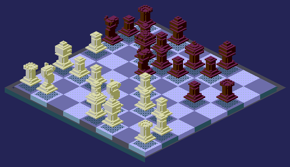

# README-Chess

<p align="center"></p>

Isometric voxel chess for GitHub READMEs. Generates PNG, SVG and animated GIF from `.vox` models. The Python package is `voxchess`.

The engine rests on one property of the 2:1 dimetric projection: **voxel `(x+1, y+1, z+1)` projects exactly onto `(x, y, z)`**. Two core operations follow from it:

- **Camera culling** — a voxel whose diagonal neighbour is occupied is invisible and is dropped entirely. Removes 62–65% of the volume.
- **Painter's order** — sorting by `(x + y + z)` ascending is exact for this projection.

---

## ♟️ Play Community Chess

Anyone can play. Click a link under **TO** and it opens a pre-filled GitHub issue —
just submit it. A GitHub Action ([`.github/workflows/chess.yml`](.github/workflows/chess.yml))
validates the move, **animates it with voxchess as the isometric GIF below**, and
commits the result. White moves first, and you can't move twice in a row.

> [**♟️ Start a new game**](https://github.com/wesleyruiz2005/README-Chess/issues/new?title=Chess%3A+Start+new+game&body=Please+do+not+change+the+title.+Just+click+%22Submit+new+issue%22.+You+don%27t+need+to+do+anything+else+%3AD)

It's <!-- BEGIN TURN -->white<!-- END TURN --> turn.

<!-- BEGIN CHESS BOARD -->
<p align="center"></p>
<!-- END CHESS BOARD -->

**▸ Your move** (appears once a game starts)

<!-- BEGIN MOVES LIST -->
|  FROM  | TO (Just click a link!) |
| :----: | :---------------------- |
| **A2** | [A3](https://github.com/wesleyruiz2005/README-Chess/issues/new?body=Please+do+not+change+the+title.+Just+click+%22Submit+new+issue%22.+You+don%27t+need+to+do+anything+else+%3AD&title=Chess%3A+Move+A2+to+A3), [A4](https://github.com/wesleyruiz2005/README-Chess/issues/new?body=Please+do+not+change+the+title.+Just+click+%22Submit+new+issue%22.+You+don%27t+need+to+do+anything+else+%3AD&title=Chess%3A+Move+A2+to+A4) |
| **B1** | [A3](https://github.com/wesleyruiz2005/README-Chess/issues/new?body=Please+do+not+change+the+title.+Just+click+%22Submit+new+issue%22.+You+don%27t+need+to+do+anything+else+%3AD&title=Chess%3A+Move+B1+to+A3), [C3](https://github.com/wesleyruiz2005/README-Chess/issues/new?body=Please+do+not+change+the+title.+Just+click+%22Submit+new+issue%22.+You+don%27t+need+to+do+anything+else+%3AD&title=Chess%3A+Move+B1+to+C3) |
| **B4** | [B5](https://github.com/wesleyruiz2005/README-Chess/issues/new?body=Please+do+not+change+the+title.+Just+click+%22Submit+new+issue%22.+You+don%27t+need+to+do+anything+else+%3AD&title=Chess%3A+Move+B4+to+B5) |
| **C1** | [A3](https://github.com/wesleyruiz2005/README-Chess/issues/new?body=Please+do+not+change+the+title.+Just+click+%22Submit+new+issue%22.+You+don%27t+need+to+do+anything+else+%3AD&title=Chess%3A+Move+C1+to+A3), [B2](https://github.com/wesleyruiz2005/README-Chess/issues/new?body=Please+do+not+change+the+title.+Just+click+%22Submit+new+issue%22.+You+don%27t+need+to+do+anything+else+%3AD&title=Chess%3A+Move+C1+to+B2) |
| **C2** | [C3](https://github.com/wesleyruiz2005/README-Chess/issues/new?body=Please+do+not+change+the+title.+Just+click+%22Submit+new+issue%22.+You+don%27t+need+to+do+anything+else+%3AD&title=Chess%3A+Move+C2+to+C3), [C4](https://github.com/wesleyruiz2005/README-Chess/issues/new?body=Please+do+not+change+the+title.+Just+click+%22Submit+new+issue%22.+You+don%27t+need+to+do+anything+else+%3AD&title=Chess%3A+Move+C2+to+C4) |
| **D2** | [D3](https://github.com/wesleyruiz2005/README-Chess/issues/new?body=Please+do+not+change+the+title.+Just+click+%22Submit+new+issue%22.+You+don%27t+need+to+do+anything+else+%3AD&title=Chess%3A+Move+D2+to+D3), [D4](https://github.com/wesleyruiz2005/README-Chess/issues/new?body=Please+do+not+change+the+title.+Just+click+%22Submit+new+issue%22.+You+don%27t+need+to+do+anything+else+%3AD&title=Chess%3A+Move+D2+to+D4) |
| **E2** | [E3](https://github.com/wesleyruiz2005/README-Chess/issues/new?body=Please+do+not+change+the+title.+Just+click+%22Submit+new+issue%22.+You+don%27t+need+to+do+anything+else+%3AD&title=Chess%3A+Move+E2+to+E3), [E4](https://github.com/wesleyruiz2005/README-Chess/issues/new?body=Please+do+not+change+the+title.+Just+click+%22Submit+new+issue%22.+You+don%27t+need+to+do+anything+else+%3AD&title=Chess%3A+Move+E2+to+E4) |
| **F2** | [F3](https://github.com/wesleyruiz2005/README-Chess/issues/new?body=Please+do+not+change+the+title.+Just+click+%22Submit+new+issue%22.+You+don%27t+need+to+do+anything+else+%3AD&title=Chess%3A+Move+F2+to+F3), [F4](https://github.com/wesleyruiz2005/README-Chess/issues/new?body=Please+do+not+change+the+title.+Just+click+%22Submit+new+issue%22.+You+don%27t+need+to+do+anything+else+%3AD&title=Chess%3A+Move+F2+to+F4) |
| **G1** | [F3](https://github.com/wesleyruiz2005/README-Chess/issues/new?body=Please+do+not+change+the+title.+Just+click+%22Submit+new+issue%22.+You+don%27t+need+to+do+anything+else+%3AD&title=Chess%3A+Move+G1+to+F3), [H3](https://github.com/wesleyruiz2005/README-Chess/issues/new?body=Please+do+not+change+the+title.+Just+click+%22Submit+new+issue%22.+You+don%27t+need+to+do+anything+else+%3AD&title=Chess%3A+Move+G1+to+H3) |
| **G2** | [G3](https://github.com/wesleyruiz2005/README-Chess/issues/new?body=Please+do+not+change+the+title.+Just+click+%22Submit+new+issue%22.+You+don%27t+need+to+do+anything+else+%3AD&title=Chess%3A+Move+G2+to+G3), [G4](https://github.com/wesleyruiz2005/README-Chess/issues/new?body=Please+do+not+change+the+title.+Just+click+%22Submit+new+issue%22.+You+don%27t+need+to+do+anything+else+%3AD&title=Chess%3A+Move+G2+to+G4) |
| **H2** | [H3](https://github.com/wesleyruiz2005/README-Chess/issues/new?body=Please+do+not+change+the+title.+Just+click+%22Submit+new+issue%22.+You+don%27t+need+to+do+anything+else+%3AD&title=Chess%3A+Move+H2+to+H3), [H4](https://github.com/wesleyruiz2005/README-Chess/issues/new?body=Please+do+not+change+the+title.+Just+click+%22Submit+new+issue%22.+You+don%27t+need+to+do+anything+else+%3AD&title=Chess%3A+Move+H2+to+H4) |
<!-- END MOVES LIST -->

<details>
<summary><b>▸ Recent moves &amp; top players</b></summary>

<!-- BEGIN LAST MOVES -->

| Move | Author |
| :--: | :----- |
| `A7` to `A6` | [ @CharlyFernando](https://github.com/CharlyFernando) |
| `B2` to `B4` | [ @wesleyruiz2005](https://github.com/wesleyruiz2005) |
| `Start game` | [ @wesleyruiz2005](https://github.com/wesleyruiz2005) |

<!-- END LAST MOVES -->

<!-- BEGIN TOP MOVES -->

| Total moves |  User  |
| :---------: | :----- |
| 2 | [@wesleyruiz2005](https://github.com/wesleyruiz2005) |
| 1 | [@CharlyFernando](https://github.com/CharlyFernando) |

<!-- END TOP MOVES -->

</details>

---

## Installation

```bash
pip install -r requirements.txt
```

`numpy` and `pillow` are required. `scipy` is used only by `inspect`, `chess` only by `--random`, `cairosvg` only to rasterize the SVG in tests.

---

## Quick start

```bash
# board from a random legal position
python -m voxchess board --random --scale 2 --out board.png

# SVG at maximum resolution, no effects
python -m voxchess board --format svg --voxel 16 --square 11 --frame 0 --out board.svg

# animated knight jump
python -m voxchess animate --random --from e2 --to f4 --theme fosforo --out jump.gif

# comparison sheet of every render mode
python -m voxchess sheet --voxel 6 --scale 2 --out modes.png

# metrics of a model
python -m voxchess inspect --model models/king.vox

# .vox -> hand-editable ASCII
python -m voxchess convert --model models/rook.vox --to txt
```

`examples/make_all.py` produces every deliverable in one run.

---

## Add it to your own README

1. Copy into your repository: `voxchess/`, `models/`, `data/`, `games/`,
   `requirements.txt` and `.github/workflows/chess.yml`.
2. Paste the chess block from the top of this README into yours — the
   `<!-- BEGIN ... -->` / `<!-- END ... -->` markers, the turn line, the board
   image, the moves list and the details block. **Keep the markers**: the Action
   rewrites the text between them on every move.
3. In the *Start a new game* link, replace `<owner>/<repo>` with your own
   `user/repository`. The move links and the board GIF are filled in automatically
   by the Action.

The Action authenticates with the built-in `GITHUB_TOKEN` — nothing to configure.

---

## Render modes

`--mode` accepts six modes. Cost measured in polygons per piece:

| Mode | pawn | rook | knight | bishop | queen | king | Notes |
|---|---|---|---|---|---|---|---|
| `solid` | 189 | 221 | 285 | 248 | 350 | 313 | Default. Exact painter's order |
| `greedy` | 55 | 92 | 71 | 85 | 123 | 93 | 3–4× fewer polygons. Breaks painter's order |
| `flat` | 189 | 221 | 285 | 248 | 350 | 313 | Single-tone silhouette |
| `top` | 97 | 105 | 133 | 101 | 189 | 191 | Tops only: plan view |
| `layers` | 189 | 221 | 285 | 248 | 350 | 313 | Each Z level with its own tint |
| `wire` | 189 | 221 | 285 | 248 | 350 | 313 | Outline, no fill |

`greedy` merges coplanar faces, which reduces the DOM but destroys depth order: back faces draw over front faces and the model reads as transparent. Valid for flat surfaces (the board squares use it) and convex models. Use `solid` for pieces.

Black pieces are rotated 180° around Z so both sides face each other.

---

## Color system

Luminance is fixed by **face orientation** and **material band**; hue only disambiguates. The volume reads the same in any theme and contrast is measurable.

```python
BANDS = {
    "piece_light":  (0.91, 0.75, 0.63),   # top / left / right in OKLCH
    "square_light": (0.76, 0.64, 0.56),
    "square_dark":  (0.56, 0.46, 0.40),
    "piece_dark":   (0.40, 0.30, 0.24),
}
```

The bands do not overlap: piece_light > square_light > square_dark > piece_dark. With a single luminance for all tops, both sides would be identical in brightness and differ only in hue.

`board` prints the contrast report. The critical case is light piece on light square (ΔL ≈ 0.10), resolved by the dithered shadow.

### Themes

`acero`, `ambar`, `fosforo`, `magenta`. Passed via `--theme`, or build a custom one with `Palette({...})`.

### Color normalization

Two independent axes:

- `--quantize` applies to the **palette**: `none`, `12bit` (4 bits per channel, Amiga OCS — every channel a multiple of `0x11`), `8bit` (RGB332).
- `--post-quantize` applies to the **final image**, after compositing. Useful to force RGB332 over an already-rendered scene.

`8bit` uses bit-replication reconstruction, matching VGA hardware:

```python
out[R] = (r << 5) | (r << 2) | (r >> 1)     # 3 bits -> 8
out[B] = (b << 6) | (b << 4) | (b << 2) | b  # 2 bits -> 8
```

---

## Geometry

The **voxel width must be even**: `h = w/2` and `d = w/2` must be integers or `crispEdges` and NEAREST scaling break the edges. Available scales: 2, 4, 6, 8, 12, 16.

Scaling is always by an **integer factor**. Any fraction destroys the pixel art.

`BoardLayout.occlusion_rows(height)` measures how many rows a piece occludes toward the back. Square 14, pieces 20 voxels gives 2.86.

---

## Model formats

`voxchess.vox` reads and writes four formats:

| Format | Purpose |
|---|---|
| `.vox` | MagicaVoxel 150. Editable in MagicaVoxel or Goxel |
| `.txt` | ASCII by layers. Hand-editable, git-legible diff |
| `.json` | Per-column RLE. The format to version |
| `.npz` | numpy compressed. Runtime load |

### Editing a `.vox`

Convert the model to ASCII, edit by hand, then validate:

```bash
python -m voxchess convert --model models/rook.vox --to txt
# edit models/rook.txt
python -m voxchess inspect --model models/rook.txt
```

The ASCII is one layer per block, from `z=0` (base) upward, `#` filled and `.` empty:

```
size 9 9 13

; --- z=12  area=28
z 12
.#.##.#..
##.##.##.
.........
```

When validating with `inspect`, check four things:

- `grounded: true` — otherwise the piece floats above the board
- `components: 1` — more than one means loose voxels in the air
- `levels` — all should be 1 except the stem
- `greedy` — the real SVG cost

Any of `.vox`, `.txt` or `.json` is a valid input to `inspect`, `convert`, `board`, `animate` and `sheet`; `load_set` picks the first that exists, in that order.

### Generating the versions

`vox.save_set(directory, models)` writes every format at once — `vox/`, `txt/` and `json/` subdirectories plus a single `pieces.npz`:

```python
from voxchess import vox
models = vox.load_set("models")           # dict[str, np.ndarray]
vox.save_set("build", models)             # build/vox, build/txt, build/json, build/pieces.npz
```

Restrict the formats with `formats=("vox", "json")`. To regenerate a single format from the CLI, use `convert --to txt` or `--to json`.

---

## Structure

```
voxchess/
  vox.py         .vox / ASCII / RLE / npz
  grid.py        culling, greedy meshing, decimation, metrics
  color.py       OKLCH, bands, themes, quantization, Bayer
  iso.py         2:1 dimetric projection
  modes.py       the six render modes
  board.py       layout, FEN, random positions
  render_png.py  PIL rasterizer with effects
  render_svg.py  SVG emitter with <symbol>/<use>
  animate.py     move interpolation and GIF
  cli.py         command line
models/          the six pieces in .vox
examples/        make_all.py
```
